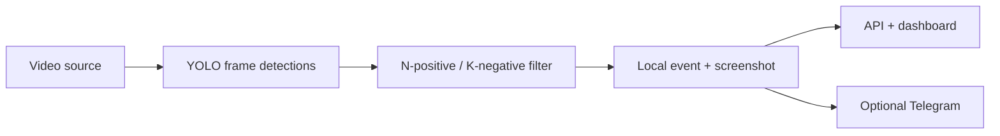

# Temporal Violence Event Filter

This project explores how noisy frame-level violence classifications can be
converted into persistent, alertable events. A pretrained YOLOv8 checkpoint
supplies frame detections; the project contribution is the surrounding
streaming pipeline, temporal state machine, event persistence, Telegram
integration, runtime diagnostics, and reproducible threshold experiment.


## Problem and approach

A frame classifier can alternate between positive and negative predictions during the same scene. Triggering on every positive frame produces noisy duplicate alerts. Waiting for several positive frames reduces noise but delays the event.

The experiment compares detector confidence, consecutive-positive thresholds
of 1, 3, 5, and 10 frames, and one- versus three-negative-frame release. It
records:

- false triggers on non-violent footage;
- duplicate triggers inside a ground-truth event;
- video-time delay from ground-truth onset to the alertable event;
- delay introduced by negative-frame release;
- detected and missed ground-truth events.

The same saved detector traces are replayed through every temporal setting, so
changes in results come from the event policy rather than repeated inference.



The capture and inference path runs in one processing loop. The API runs that
loop in a background thread. Telegram submission uses a separate worker.
Background execution does not guarantee dashboard responsiveness under load.

## Measured result

The committed two-clip case study replays 848 nonviolent observations and 694
violent observations through 32 combinations of confidence, positive-frame,
and negative-release settings. The committed JSON is checked against fresh
replay by the test suite.

| C | N | K | False events: meeting | Violent-clip triggers | Duplicates | First alert |
| ---: | ---: | ---: | ---: | ---: | ---: | ---: |
| 0.40 | 1 | 1 | 29 | 81 | 80 | 0.0000 s |
| 0.55 | 5 | 1 | 5 | 10 | 9 | 1.7917 s |
| **0.70** | **5** | **3** | **3** | **8** | **7** | **1.7917 s** |
| 0.70 | 10 | 3 | 1 | 1 | 0 | 28.0833 s |
| 0.85 | 1 | 1 | 0 | 0 | 0 | missed |

The provisional default is C=0.70, N=5, K=3. It reduced false and duplicate
events compared with the earlier C=0.55, N=5, K=1 policy without increasing
the measured first-alert delay. The stronger N=10 setting delayed the alert
until the end of the violent clip, while C=0.85 missed it.

| Clip | Frames | FPS | Annotation |
| --- | ---: | ---: | --- |
| [Work meeting](https://mixkit.co/free-stock-video/people-having-a-work-meeting-around-a-table-4547/) | 848 | 30 | Nonviolent throughout |
| [Mixed martial arts](https://mixkit.co/free-stock-video/strong-female-mixed-martial-arts-fighter-40991/) | 694 | 24 | Violent throughout |

The complete 64-row result table is in
[`evaluation/case_study/summary.csv`](evaluation/case_study/summary.csv).
The saved traces, annotations, full matrices, and capture procedure are in
[`evaluation/case_study`](evaluation/case_study/README.md). More varied scenes
and clips with separate violent intervals are the next evaluation step.

## Run locally

Python 3.11 is recommended.

```bash
python -m venv venv
```

Activate the environment, then install dependencies:

```bash
pip install -r requirements.txt
python -m utils.download_model
```

Copy `.env.example` to `.env` in the repository root, beside `config.py`.
Existing environment variables and dashboard settings may override defaults.
Restart the API and dashboard after changing `.env`.

Start the API:

```bash
python -m uvicorn api.server:app --host 0.0.0.0 --port 8000
```

Start the dashboard in a second terminal:

```bash
streamlit run dashboard/app.py --server.port 8501
```

The dashboard accepts an uploaded video, a local video-file path, a webcam
index such as `0`, or an RTSP URL.

The headless pipeline can also be run directly:

```bash
python -m core.pipeline --source "path/to/video.mp4" --location "Test-Video"
```

## Detection rule

For each decoded frame:

1. YOLO returns detected boxes, class IDs, labels, and confidence values.
2. A frame is positive when at least one detection matches the configured violence class.
3. N consecutive positive frames start one event and latch it active.
4. Continued positive frames do not emit another event.
5. K consecutive negative frames release the latch so a later positive run
   can become a new event.

N controls evidence required at onset. K separately controls tolerance for
short negative gaps inside an active event. Notification cooldown does not
define event identity and does not suppress local event persistence.

Default configuration:

```text
CONFIDENCE_THRESHOLD=0.70
FRAME_CONSISTENCY=5
NEGATIVE_RELEASE_FRAMES=3
ALERT_COOLDOWN_SECONDS=30
FPS_TARGET=20
```

The C=0.70, N=5, K=3 default is provisional and selected only from the
committed two-clip case study. It must not be described as generally optimal.

`FPS_TARGET` limits ingestion rate. The dashboard's current FPS value is processed frames divided by elapsed runtime; it is not a hardware benchmark.

## Third-party model

The default checkpoint comes from [Musawer1214/Fight-Violence-detection-yolov8](https://github.com/Musawer1214/Fight-Violence-detection-yolov8) and is pinned to upstream commit:

```text
20f0d05054cff7da2dc78dee3c2de1bd54106a13
```

The upstream checkpoint exposes `non_violence` and `violence`, with class ID 1 treated as violent by default. See [THIRD_PARTY_MODELS.md](THIRD_PARTY_MODELS.md).

## Repeatable filter comparison

Each sample video is inferred once at a 0.25 capture floor into a saved
frame-level trace. Confidence thresholds of 0.40, 0.55, 0.70, and 0.85;
positive thresholds of 1, 3, 5, and 10; and negative-release values of 1 and
3 then replay the same detector outputs. Differences therefore come from the
decision settings rather than separate inference runs.

```bash
python -m evaluation.temporal evaluation/case_study/violence_trace.csv --confidence-thresholds 0.40,0.55,0.70,0.85 --thresholds 1,3,5,10 --negative-release-frames 1,3
```

Export one combined table and a dependency-free SVG trade-off plot:

```bash
python -m evaluation.report --trace nonviolence=evaluation/case_study/nonviolence_trace.csv --trace violence=evaluation/case_study/violence_trace.csv --csv evaluation/case_study/summary.csv --svg evaluation/case_study/tradeoff.svg
```

New trace captures also create a `.metadata.json` sidecar containing SHA-256
hashes for the source video and checkpoint plus the Python, Ultralytics,
OpenCV, and NumPy versions used for inference.

## Local events and optional Telegram

Every qualified event is recorded before notification policy is considered.
`logs/event_history.json` stores the event ID, detection timestamp, source,
class, confidence, screenshot path, and separate notification fields.
Screenshots are written under `screenshots/`. History writes use temporary
files followed by replacement. The persisted history retains the latest 1,000
records. Screenshot retention defaults to 500 images, so older records may
outlive their images. This is bounded local history, not an archival store.

Telegram is disabled by default. To enable it, set these in the root `.env`:

```dotenv
ENABLE_TELEGRAM_ALERTS=true
TELEGRAM_BOT_TOKEN=your_private_bot_token
TELEGRAM_CHAT_ID=your_recipient_chat_id
```

Create the bot through Telegram's BotFather and send `/start` to it from the
intended recipient account. Use the numeric ID of that conversation, not the
bot's own ID. Keep the token outside Git and logs. In the dashboard, enable
Telegram in Settings and save before starting a run. Telegram receives the
image directly through an HTTP photo upload; no hosted-media service is needed.

| Notification state | Meaning |
| --- | --- |
| `not_attempted` | Disabled, unconfigured, another submission pending, or cooldown active; the suppression reason identifies which |
| `queued` | Submission worker scheduled; not a successful message |
| `accepted` | Telegram API accepted the submission; no claim about recipient viewing |
| `failed` | Submission failed, or its outcome became unknown after restart |

Cooldown starts only after acceptance. Events occurring during cooldown or
while another submission is pending still persist locally. Failure releases
the pending guard, but does not automatically retry the same latched event.
There is no durable delivery queue. A process exit may interrupt a worker;
previously queued records are treated as failed with an unknown-outcome error
when loaded again. Legacy sender-success history remains readable as accepted
submission, never as proof of recipient viewing.

The project owner reported receiving Telegram images during a real test on
September 8, 2026. Earlier exported records also demonstrated actual provider
rejection of a bot-as-recipient configuration. These observations establish
one working setup and one rejection path, not general delivery reliability.

## Runtime and dashboard

The dashboard provides source selection, start/stop, the current frame,
temporal settings, active-event state, event history, screenshots, notification
outcomes, and the last runtime error. Refresh is optional and disabled by
default. With refresh disabled, displayed status changes on the next rerun.
Uploaded videos are stored in `runtime_uploads/`; the dashboard and API must
share that filesystem. Uploaded files are not automatically purged.

`/status` retains diagnostics while idle. Normal file completion is `ended`,
manual stopping is `stopped`, and an unrecovered live-source read is
`disconnected`. Source opening, inference, and pipeline exceptions retain an
error stage, message, and UTC timestamp. Notification rejection is recorded
on the event and does not erase it. The live reader makes one reconnect
attempt; real RTSP recovery has not been validated. An unsuccessful file read
is treated as completion, so this does not prove a corrupt file decoded fully.

Run one pipeline process against a history directory. Local JSON persistence
has no coordination for multiple independent writers. Stop is cooperative;
an in-progress OpenCV read or model call can delay shutdown.

## Verification and limitations

```bash
pip install -r requirements-dev.txt
python -m pytest -q
```

Tests cover state transitions, shared runtime/replay logic, API behavior,
failure visibility, persistence independent of notification eligibility,
mocked Telegram acceptance/rejection, upload storage, and exact replay of
the two saved traces. Synthetic and mocked checks establish implementation
behavior. Saved real detector traces establish only this case study.

| Project claim | Evidence |
| --- | --- |
| Runtime and replay use the same temporal semantics | State-machine and replay tests |
| Events persist through notification suppression or failure | Pipeline and alert-manager tests |
| Result files match replayed detector traces | Case-study evidence test |
| Telegram submits an event screenshot | HTTP integration tests and a user-verified live receipt |
| Runtime failures remain visible through the API | Pipeline and API failure-path tests |

The model is pretrained and frame-based. The two-clip result is a controlled
case study rather than a general accuracy estimate. Alert delay is measured in
video time; end-to-end latency and sustained RTSP operation have not yet been
benchmarked. New captures record source and model hashes plus exact inference
dependency versions.

## License and responsible use

Use only footage and camera sources you are authorized to process. This experiment is unsuitable for autonomous safety decisions or unreviewed surveillance.
