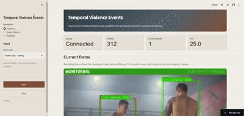
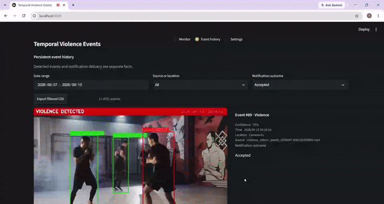
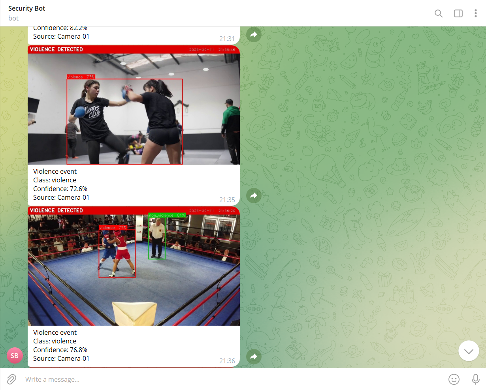
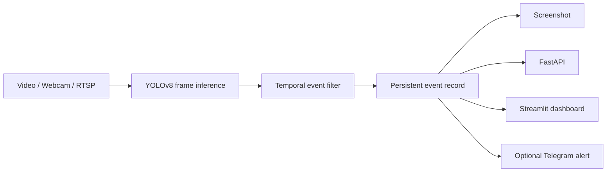

# Real-Time Violence Event Detection

A video monitoring system that turns noisy frame-level violence predictions into persistent events that can be reviewed, stored, and alerted on.

The project uses a pretrained YOLOv8 violence detector for frame inference, then adds the engineering around it: a custom temporal decision layer, event persistence, FastAPI controls, a Streamlit dashboard, Telegram alerts, runtime diagnostics, and reproducible threshold evaluation.

## What I built

I did not train the YOLO checkpoint used for frame inference. My work was the system around it: the temporal event logic, pipeline, event storage, API, dashboard, Telegram delivery, failure reporting, and the evaluation used to choose the default settings.

The central problem is not simply detecting a positive frame. It is deciding **when a sequence of noisy predictions should become one real event**.

## Demo

These walkthroughs show the runtime flow and the controls used to review its results.

### Clip analysis

<p align="center">
  
</p>

### Settings and event history

<p align="center">
  
</p>

## Project snapshot

| Area | Current implementation |
|---|---|
| Frame inference | Pretrained YOLOv8 violence checkpoint |
| Event logic | Consecutive N-positive / K-negative state machine |
| Alternative evaluated | Rolling M-of-W voting |
| Evaluation | 17,289 saved frame observations across development and held-out clips |
| Reviewed clips | 35 violent, nonviolent, and hard-negative scenes |
| Runtime interfaces | FastAPI + Streamlit |
| Alerts | Optional Telegram image notifications |
| Verification | Automated tests + committed detector traces and result tables |





---

## Why temporal event filtering matters

Frame-level classifiers can fluctuate rapidly during the same scene:

```text
positive → positive → negative → positive → positive ...
```

Alerting on every positive frame creates duplicate alerts, unstable event boundaries, and unnecessary false alarms. This project introduces an event layer on top of the detector.

The default policy uses two rules:

```text
N positive frames → start event
K negative frames → release event
```

For example, with `N=5` and `K=3`, five consecutive positive observations are required before an event is created, while three consecutive negative observations release the active event.

```text
Frames:
- - + + + + + + + - + + - - -

State:
idle
      └──────── active event ────────┘
```

The state machine is implemented independently from the model and is shared by live inference and offline trace replay.

---

## How the approach changed

- The first version treated positive frames too independently, which produced unstable and repeated alerts.
- I added consecutive positive-frame qualification and negative-frame release so detections became persistent events.
- I then tested rolling-window voting because it could tolerate brief negative predictions.
- Rolling voting reacted slightly faster, but produced more false and duplicate events, so I kept the simpler consecutive-frame policy.

## Main engineering contribution

The pretrained checkpoint provides frame-level detections. The repository focuses on building a usable system around those detections.

### Detection and temporal logic

`core/detector.py` loads the YOLO checkpoint, converts predictions into structured results, determines whether a configured violence class is present, and passes the frame decision into the temporal filter.

`core/temporal.py` contains both the default consecutive-frame policy and the rolling-window alternative. It tracks event activation, release, positive evidence, and negative release evidence independently from model inference.

### Pipeline

`core/pipeline.py` coordinates the full runtime path:

```text
video source
   ↓
model inference
   ↓
temporal decision
   ↓
event creation
   ↓
screenshot
   ↓
notification request
```

Runtime state and failures are retained so the API and dashboard can distinguish normal completion, disconnection, manual stop, and inference/source errors.

### Event persistence and notification delivery

Detected events are stored **before** notification policy is evaluated:

```text
Violence event detected
        ↓
Persist event locally
        ↓
Save screenshot
        ↓
Check notification policy
        ↓
Send Telegram if eligible
```

This keeps event history independent from Telegram configuration, cooldowns, or delivery failures.

Records distinguish `not_attempted`, `queued`, `accepted`, and `failed`. An accepted submission starts cooldown but never suppresses local event creation.

---

## Evaluation

The temporal layer is evaluated without rerunning YOLO for every configuration. Each sample video is inferred once and saved as a frame-level detector trace, then those exact predictions are replayed through different temporal settings.

The development case study uses **4,213 frame observations** across:

- 4 confidence thresholds
- 4 positive-frame thresholds
- 2 negative-release thresholds
- **32 configurations**
- a **256-row combined result table**

The eight reviewed clips include:

**Nonviolent / hard-negative scenes**
- meeting
- crowded subway
- students walking
- close physical contact
- soldiers holding weapons

**Combat-like scenes**
- mixed martial arts
- intermittent punching
- fencing

### Threshold trade-off

A subset of the measured configurations:

| Confidence | Positive N | Release K | False events on meeting | Violent-clip triggers | Duplicate triggers | First alert |
|---:|---:|---:|---:|---:|---:|---:|
| 0.40 | 1 | 1 | 29 | 81 | 80 | 0.0000 s |
| 0.55 | 5 | 1 | 5 | 10 | 9 | 1.7917 s |
| **0.70** | **5** | **3** | **3** | **8** | **7** | **1.7917 s** |
| 0.70 | 10 | 3 | 1 | 1 | 0 | 28.0833 s |
| 0.85 | 1 | 1 | 0 | 0 | 0 | missed |

The current case-study default is:

```text
CONFIDENCE_THRESHOLD=0.70
FRAME_CONSISTENCY=5
NEGATIVE_RELEASE_FRAMES=3
```

The experiment shows the expected trade-off: permissive settings react quickly but create more false and duplicate events, while stronger settings improve stability at the cost of delay and missed detections.

At the selected setting, the additional nonviolent test clips remained clean while the MMA and intermittent-fighting clips were detected. Fencing remained a detector-level miss across the evaluated settings, illustrating the boundary between temporal filtering and the underlying classifier.

### Consecutive frames vs rolling-window voting

A second deterministic policy was replayed on the same 4,213 observations at `C=0.70` and `K=3`. The baseline requires five consecutive positives; the alternative triggers after at least five positives in the latest seven processed frames.

| Policy | False events | Duplicate triggers | Positive clips detected | Positive clips missed |
|---|---:|---:|---:|---:|
| Consecutive N=5 | 3 | 9 | 2 | 1 |
| Rolling M=5 of W=7 | 4 | 10 | 2 | 1 |

Rolling voting reduced the coarse intermittent-clip delay from 2.16 to 1.92 video seconds, but also added one meeting false event and one MMA duplicate. The measured trade-off therefore did not justify replacing the simpler consecutive-frame default. Per-clip results are committed in [`evaluation/case_study/strategy_comparison.csv`](evaluation/case_study/strategy_comparison.csv).

### Held-out clip batch

The frozen operating point was then replayed on **27 additional clips** from
independent stock-video scenes: **13,076 observations**, 9 reviewed positive
intervals, and 18 nonviolent or hard-negative clips. Labels were reviewed from
the footage before inference. Combat sports are treated as positive under the
case-study convention; arguments, close contact, exercise, archery, and
training against equipment are nonviolent unless a person-to-person violent
interval is visible. The manifest records each source page and annotation.

No confidence or temporal setting was retuned on this batch.

| Policy | Total triggers | False triggers | Duplicate triggers | Positive intervals detected | Missed intervals | Mean alert delay |
|---|---:|---:|---:|---:|---:|---:|
| Consecutive N=5 | 44 | 22 | 17 | 5 / 9 | 4 | 3.4174 s |
| Rolling M=5 of W=7 | 54 | 25 | 24 | 5 / 9 | 4 | 2.2727 s |

Rolling voting was faster on detected intervals, but increased false and
duplicate triggers without recovering an additional positive interval. The
additional batch therefore reinforces consecutive qualification as the default.
This remains a modest stock-video evaluation, not a benchmark or a claim of
general-world accuracy.

The reproducible manifest, trace metadata, per-clip comparison, and aggregate table are in [`evaluation/held_out/`](evaluation/held_out/).

---

## Reproducing the evaluation

Replay, report generation, and strategy comparison are implemented in [`evaluation/`](evaluation/), with case-study commands documented in [`evaluation/case_study/README.md`](evaluation/case_study/README.md). New captures record source and model hashes alongside dependency versions.

---

## Running the project

Python **3.11** is recommended.

```bash
python -m venv venv
pip install -r requirements.txt
python -m utils.download_model
```

Copy `.env.example` to `.env` in the repository root and update the required settings.

### Start the API

```bash
python -m uvicorn api.server:app --host 0.0.0.0 --port 8000
```

### Start the dashboard

```bash
streamlit run dashboard/app.py --server.port 8501
```

The dashboard supports webcam input, uploaded video, a local video path, and RTSP sources. The Pipeline page focuses on the current run, while older persisted records can be reviewed or exported from Event History.

### Run the pipeline directly

```bash
python -m core.pipeline \
  --source "path/to/video.mp4" \
  --location "Test-Video"
```

---

## Configuration

Defaults are `C=0.70`, `N=5`, `K=3`, consecutive filtering, a seven-frame rolling window, 30-second alert cooldown, and a 20 FPS ingestion target. Override them through the root `.env`; [`config.py`](config.py) and [`.env.example`](.env.example) contain the complete reference.

---

## Telegram alerts

Telegram is optional and disabled by default. Credentials are configured through `.env`; eligible events send their saved screenshots. Image receipt was verified on **September 8, 2026**.

---

## Event history and runtime state

Events are stored locally in `logs/event_history.json`. Records can include event ID, timestamp, detected class, confidence, location, source, screenshot path, and notification status/details. The latest 1,000 event records are retained, with screenshots managed under a separate bounded-retention policy.

Runtime state distinguishes normal completion, manual stopping, disconnection, and failure. Failures retain their stage, message, and UTC timestamp for inspection through the API and dashboard.

---

## Testing

Install development dependencies and run the suite:

```bash
pip install -r requirements-dev.txt
python -m pytest -q
```

The tests cover temporal transitions, detector logic, pipeline and API behavior, runtime failure visibility, event persistence, notification suppression, mocked Telegram outcomes, uploaded-video handling, trace capture, evaluation reporting, strategy replay, and committed case-study consistency.

---

## Model provenance

The default checkpoint comes from **Musawer1214/Fight-Violence-detection-yolov8** and is pinned to upstream commit:

```text
20f0d05054cff7da2dc78dee3c2de1bd54106a13
```

It exposes the classes `non_violence` and `violence`, with class ID `1` treated as violent by default. See [`THIRD_PARTY_MODELS.md`](THIRD_PARTY_MODELS.md) for provenance and attribution.

---

## Scope and limitations

This is an applied systems study around a third-party frame classifier, not a newly trained model or a general benchmark. Temporal filtering cannot recover detector misses; the evaluation uses a limited stock-video sample and reports video-time delay. Persistence is local JSON and Telegram has no durable retry queue.

---

## Responsible use

Process only footage and camera sources you are authorized to use. This system is experimental and should not be used for autonomous safety decisions, law-enforcement decisions, or unreviewed surveillance.
