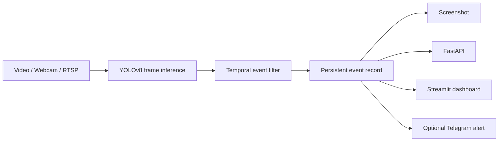
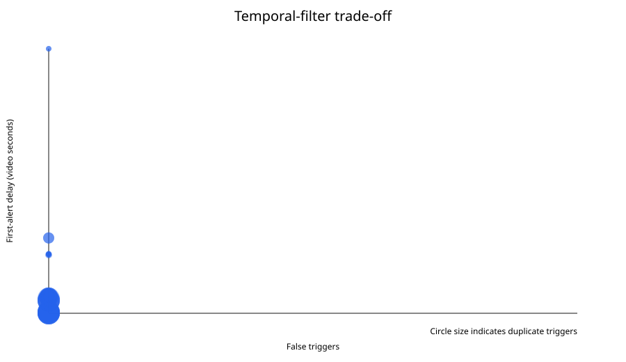

# Temporal Violence Event Detection

A real-time video monitoring system that converts noisy frame-level violence predictions into persistent, alertable events.

The project uses a pretrained YOLOv8 violence detector for frame inference, then adds a custom temporal decision layer, event persistence, API, Streamlit dashboard, Telegram alerts, runtime diagnostics, and a reproducible threshold-evaluation pipeline.

The main engineering problem is not simply detecting a positive frame. It is deciding **when a sequence of noisy predictions should become one real event**.

---

## Why this project exists

Frame-level classifiers can fluctuate rapidly during the same scene:

```text
positive → positive → negative → positive → positive ...
```

Triggering an alert on every positive frame creates:

* duplicate alerts,
* false alarms,
* unstable event boundaries,
* poor operator experience.

This project adds a temporal event filter on top of the detector.



An event begins only after enough consecutive positive observations and remains active until enough negative observations are seen.

This converts individual predictions into a more useful event stream.

---

# Key Features

* Real-time violence inference using a pretrained YOLOv8 checkpoint
* Custom **N-positive / K-negative temporal state machine**
* Configurable confidence and temporal thresholds
* Persistent local event history
* Automatic event screenshots
* FastAPI runtime backend
* Streamlit monitoring dashboard
* Video upload, local file, webcam, and RTSP sources
* Optional Telegram image alerts
* Notification cooldown without dropping detected events
* Runtime and failure diagnostics
* Reproducible temporal-filter evaluation
* Saved detector traces for threshold replay
* Automated tests covering pipeline, API, event logic, alerts, and evaluation

---

# Main Engineering Contribution

The pretrained model provides frame-level detections.

The main contribution of this repository is the system surrounding those detections.

## Temporal event state machine

A frame is considered positive when at least one configured violence class is detected.

The filter then applies two independent rules:

```text
N positive frames → start event
K negative frames → release event
```

For example:

```text
N = 5
K = 3
```

means five consecutive positive observations are required before an event is created, while three consecutive negative observations are required before the event becomes inactive again.

```text
Frames:
- - + + + + + + + - + + - - -

State:
idle
      └──────── active event ────────┘
```

The state machine prevents every positive frame from becoming a separate alert.

It is implemented independently from the model and is shared by both live inference and offline trace replay.

---

# Architecture

```text
violence_detection/
│
├── core/
│   ├── detector.py
│   ├── temporal.py
│   ├── pipeline.py
│   └── stream.py
│
├── alerts/
│   ├── alert_manager.py
│   └── telegram_alert.py
│
├── api/
│   └── server.py
│
├── dashboard/
│   └── app.py
│
├── evaluation/
│   └── case_study/
│
├── tests/
│
├── config.py
├── requirements.txt
└── README.md
```

### `core/detector.py`

Loads the YOLO model, converts predictions into structured detection results, determines whether each detection represents violence, and feeds the frame result into the temporal filter.

### `core/temporal.py`

Contains the standalone temporal event state machine.

It tracks:

* consecutive positive observations,
* consecutive negative observations,
* event activation,
* event release.

### `core/pipeline.py`

Coordinates:

```text
video source
   ↓
model inference
   ↓
temporal decision
   ↓
event creation
   ↓
screenshot
   ↓
notification request
```

It also records runtime state and failures so errors remain visible through the API and dashboard.

### `alerts/`

Handles event persistence and optional Telegram delivery.

Event creation and notification delivery are deliberately treated as separate concerns.

### `api/`

Exposes pipeline controls and runtime state through FastAPI.

### `dashboard/`

Provides an operator-facing Streamlit interface for:

* source selection,
* starting and stopping inference,
* current annotated frame,
* runtime status,
* event history,
* temporal settings,
* screenshots,
* notification results.

### `evaluation/`

Contains saved detector traces and tools for replaying them through multiple temporal configurations without rerunning inference.

---

# Event Persistence vs Notification Delivery

A detected event is recorded **before** notification policy is evaluated.

This is intentional.

```text
Violence event detected
        ↓
Persist event locally
        ↓
Save screenshot
        ↓
Check notification policy
        ↓
Send Telegram if eligible
```

This prevents events from disappearing simply because:

* Telegram is disabled,
* Telegram is not configured,
* another notification is pending,
* a cooldown is active,
* delivery fails.

Notification state is stored separately.

| Status          | Meaning                                         |
| --------------- | ----------------------------------------------- |
| `not_attempted` | Notification was disabled or suppressed         |
| `queued`        | Submission worker started                       |
| `accepted`      | Telegram API accepted the request               |
| `failed`        | Submission failed or outcome became unavailable |

Cooldown begins only after an accepted Telegram submission.

Local event persistence is not suppressed by notification cooldown.

---

# Temporal Filter Evaluation

The repository includes a controlled experiment measuring how different temporal settings affect event quality.

Instead of rerunning YOLO inference for every configuration, each sample video is inferred once and stored as a frame-level detector trace.

Those exact predictions are then replayed through different temporal policies.

This isolates the effect of the event-filter settings from repeated model inference.

The current case study replays:

**4,213 frame observations**

across:

* 4 confidence thresholds
* 4 positive-frame thresholds
* 2 negative-release thresholds

for:

**32 configurations**

and produces a **256-row result table**.

---

## Current Case Study

The committed evaluation set contains eight reviewed clips covering:

### Nonviolent / hard-negative scenes

* meeting
* crowded subway
* students walking
* close physical contact
* soldiers holding weapons

### Combat-like scenes

* mixed martial arts
* intermittent punching
* fencing

A subset of the measured configurations:

| Confidence | Positive N | Release K | False events on meeting | Violent-clip triggers | Duplicate triggers |  First alert |
| ---------: | ---------: | --------: | ----------------------: | --------------------: | -----------------: | -----------: |
|       0.40 |          1 |         1 |                      29 |                    81 |                 80 |     0.0000 s |
|       0.55 |          5 |         1 |                       5 |                    10 |                  9 |     1.7917 s |
|   **0.70** |      **5** |     **3** |                   **3** |                 **8** |              **7** | **1.7917 s** |
|       0.70 |         10 |         3 |                       1 |                     1 |                  0 |    28.0833 s |
|       0.85 |          1 |         1 |                       0 |                     0 |                  0 |       missed |

The current provisional default is:

```text
CONFIDENCE_THRESHOLD=0.70
FRAME_CONSISTENCY=5
NEGATIVE_RELEASE_FRAMES=3
```

The experiment demonstrates the trade-off between responsiveness and event stability.

Lower thresholds respond quickly but generate significantly more false and duplicate events.

Stronger thresholds reduce noise but can introduce large alert delays or cause events to be missed entirely.

The current default was selected only from this case study and should **not** be interpreted as generally optimal.

---

# Measured Trade-Off



At the current provisional setting:

```text
Confidence = 0.70
Positive frames = 5
Negative release = 3
```

the additional nonviolent test clips remained clean while the MMA and intermittent fighting clips were detected.

Fencing was not detected by the pretrained model at any evaluated configuration.

This illustrates an important distinction:

> The temporal filter can improve event stability, but it cannot recover events that the underlying frame classifier does not recognize.

---

# Reproducible Evaluation

Run a temporal replay:

```bash
python -m evaluation.temporal evaluation/case_study/violence_trace.csv \
  --confidence-thresholds 0.40,0.55,0.70,0.85 \
  --thresholds 1,3,5,10 \
  --negative-release-frames 1,3
```

Generate the combined result table and trade-off plot:

```bash
python -m evaluation.report \
  --trace nonviolence=evaluation/case_study/nonviolence_trace.csv \
  --trace violence=evaluation/case_study/violence_trace.csv \
  --csv evaluation/case_study/summary.csv \
  --svg evaluation/case_study/tradeoff.svg
```

New trace captures also generate a metadata sidecar containing:

* source-video SHA-256
* model-checkpoint SHA-256
* Python version
* Ultralytics version
* OpenCV version
* NumPy version

This makes saved inference traces easier to reproduce and audit.

---

# Running the Project

Python **3.11** is recommended.

## 1. Create a virtual environment

```bash
python -m venv venv
```

Activate it using the appropriate command for your operating system.

## 2. Install dependencies

```bash
pip install -r requirements.txt
```

## 3. Download the model

```bash
python -m utils.download_model
```

## 4. Configure environment variables

Copy:

```text
.env.example
```

to:

```text
.env
```

in the repository root.

Restart the API and dashboard after modifying configuration.

---

# Start the API

```bash
python -m uvicorn api.server:app --host 0.0.0.0 --port 8000
```

---

# Start the Dashboard

In a second terminal:

```bash
streamlit run dashboard/app.py --server.port 8501
```

The dashboard supports:

* webcam index such as `0` (the default selection)
* uploaded video
* local video-file path
* RTSP URL

The Pipeline page is scoped to the current run: it shows the current frame,
temporal counters, runtime state, and events created since that run started.
Older records remain persisted and can be reviewed or exported from the
separate Event History page.

Bounding boxes display the class and confidence returned by the checkpoint.
Because the supplied specialized checkpoint exposes only `violence` and
`non_violence`, it cannot identify general objects such as people or weapons.
Doing that would require a second object-detection model and is intentionally
outside this focused temporal-filter pipeline.

---

# Run the Pipeline Directly

The detection pipeline can also run without the dashboard:

```bash
python -m core.pipeline \
  --source "path/to/video.mp4" \
  --location "Test-Video"
```

---

# Configuration

Default temporal settings:

```text
CONFIDENCE_THRESHOLD=0.70
FRAME_CONSISTENCY=5
NEGATIVE_RELEASE_FRAMES=3
ALERT_COOLDOWN_SECONDS=30
FPS_TARGET=20
```

### `CONFIDENCE_THRESHOLD`

Minimum detector confidence considered during inference.

### `FRAME_CONSISTENCY`

Number of consecutive positive frames required to start an event.

### `NEGATIVE_RELEASE_FRAMES`

Number of consecutive negative frames required to release an active event.

### `ALERT_COOLDOWN_SECONDS`

Minimum interval between accepted Telegram submissions.

This does **not** suppress local event creation.

### `FPS_TARGET`

Limits video ingestion rate.

The dashboard FPS value represents:

```text
processed frames / elapsed runtime
```

and should not be interpreted as a hardware inference benchmark.

---

# Telegram Alerts

Telegram integration is optional and disabled by default.

Add the following values to `.env`:

```dotenv
ENABLE_TELEGRAM_ALERTS=true
TELEGRAM_BOT_TOKEN=your_private_bot_token
TELEGRAM_CHAT_ID=your_recipient_chat_id
```

Create a bot through Telegram BotFather and send `/start` from the account that should receive alerts.

The recipient chat ID must refer to the target conversation, not the bot itself.

When an eligible event occurs, Telegram receives the saved event screenshot directly through the Telegram Bot API.

The project owner successfully received Telegram event images during a live test on **September 8, 2026**.

This demonstrates one validated working configuration, not guaranteed delivery under all network or runtime conditions.

---

# Runtime Behavior

The pipeline tracks explicit source states such as:

```text
idle
connecting
connected
ended
stopped
disconnected
error
```

Runtime failures retain:

* error stage,
* error message,
* UTC timestamp.

This allows the dashboard and API to distinguish normal completion from failure.

The current live-stream reader performs one reconnect attempt.

Sustained RTSP recovery has not yet been benchmarked.

---

# Event History

Events are stored locally in:

```text
logs/event_history.json
```

Each event can contain:

* event ID
* timestamp
* detected class
* confidence
* location
* source
* screenshot path
* notification status
* notification channel
* notification completion timestamp
* notification error
* notification suppression reason

The latest 1,000 event records are retained.

Screenshots are stored separately and have their own bounded retention policy.

The local JSON store is intended for a single pipeline process and is not designed as a multi-writer production database.

---

# Testing

Install development dependencies:

```bash
pip install -r requirements-dev.txt
```

Run:

```bash
python -m pytest -q
```

The test suite covers:

* temporal state transitions
* detector logic
* pipeline behavior
* API behavior
* runtime failure visibility
* event persistence
* notification suppression
* mocked Telegram acceptance and rejection
* uploaded-video handling
* trace capture
* evaluation reporting
* replay of committed detector traces
* case-study result consistency

Synthetic and mocked tests verify implementation behavior.

Saved real detector traces provide evidence only for the included case study.

---

# Third-Party Model

The default checkpoint is sourced from:

**Musawer1214/Fight-Violence-detection-yolov8**

and pinned to upstream commit:

```text
20f0d05054cff7da2dc78dee3c2de1bd54106a13
```

The checkpoint exposes:

```text
non_violence
violence
```

with class ID `1` treated as violent by default.

See:

```text
THIRD_PARTY_MODELS.md
```

for model provenance and attribution.

---

# Current Limitations

This project is an applied ML systems experiment, not a production surveillance product.

Important limitations include:

* the underlying violence classifier is pretrained and third-party;
* the current evaluation contains only eight reviewed clips;
* the case study is not a general accuracy benchmark;
* fencing was missed by the underlying detector;
* temporal decisions currently depend on consecutive processed frames rather than wall-clock time;
* alert delay is measured in video time rather than full end-to-end latency;
* sustained RTSP operation has not been benchmarked;
* local JSON persistence is not suitable for multiple concurrent writers;
* uploaded dashboard videos are not automatically purged;
* Telegram delivery has no durable retry queue;
* stopping the pipeline is cooperative, so an active model call or OpenCV read can delay shutdown.

---

# Planned Improvements

The next evaluation stage will focus on increasing scene diversity and testing more difficult edge cases.

Planned work includes:

* expanding the evaluation set with more violent and nonviolent clips;
* adding additional hard negatives such as sports, running, dancing, arguments, and rapid motion;
* comparing the current consecutive-frame filter with a rolling-window or confidence-smoothing strategy;
* evaluating time-based event qualification rather than frame-count-only thresholds;
* measuring end-to-end alert latency;
* testing longer-running RTSP streams.

---

# What This Project Demonstrates

This repository is primarily an exercise in building a reliable system around imperfect ML predictions.

It demonstrates work across:

```text
Computer Vision
      +
Temporal Event Logic
      +
Backend APIs
      +
State Management
      +
Alerting
      +
Evaluation
      +
Testing
      +
Runtime Diagnostics
```

Rather than treating every model prediction as a final decision, the system introduces an explicit event layer that can be evaluated, tested, persisted, and monitored independently.

---

# Responsible Use

Process only footage and camera sources you are authorized to use.

The system is experimental and should not be used for autonomous safety decisions, law-enforcement decisions, or unreviewed surveillance.
